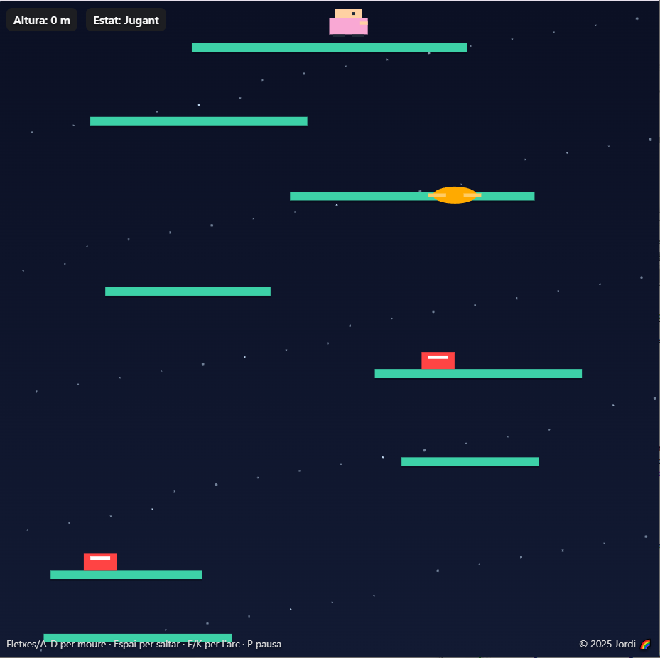
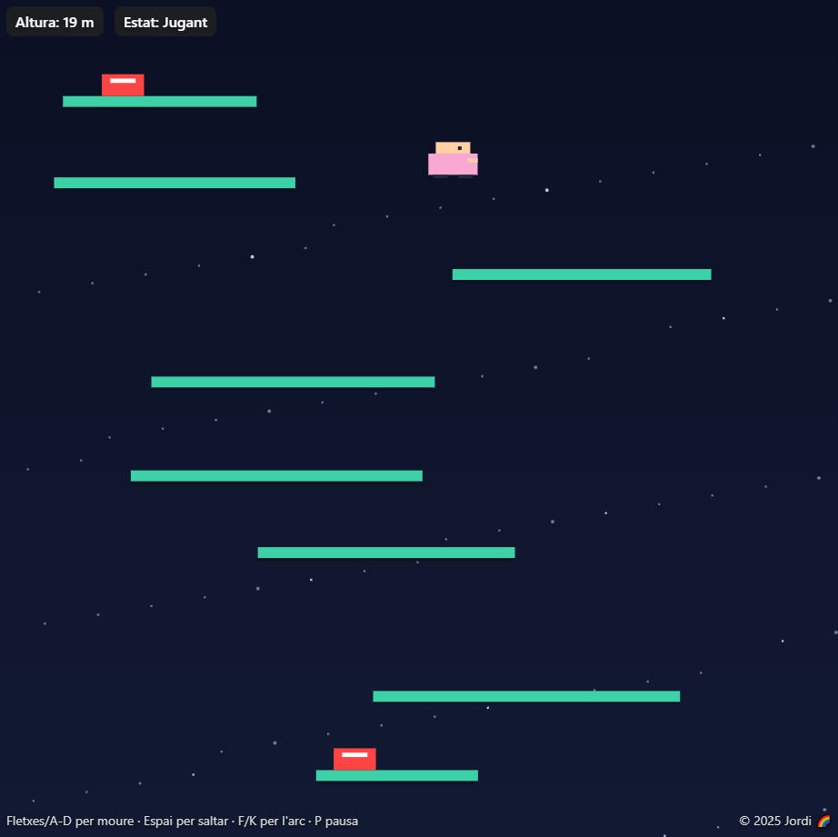
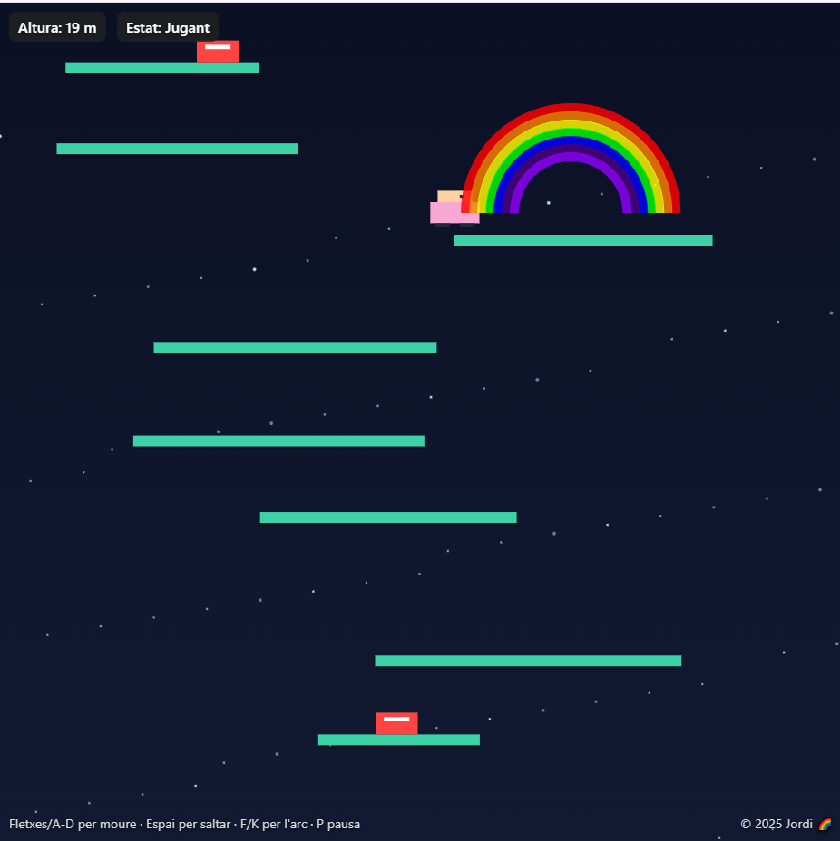

# 🌈 Salta Martí!

Un joc 2D de plataformes verticals on el nen **Martí** salta cap amunt, esquivant enemics i llançant arcs de sant Martí per netejar el cel.  
Construït amb **HTML5 Canvas + JavaScript**.

---

## 📖 La història

Martí és un nen curiós que sempre ha somiat amb tocar els núvols.  
Una nit, mentre mirava les estrelles, va descobrir que podia invocar arcs de sant Martí amb les seves mans.  
Amb aquest poder màgic, decideix emprendre un viatge vertical: saltar plataformes infinites, esquivar enemics caminants i voladors, i arribar tan amunt com pugui.  
Cada metre guanyat és un pas més a prop del seu somni: pintar el cel amb colors.

---

## 🎮 Mecànica del joc

- **Objectiu:** pujar el màxim possible sense caure ni tocar enemics.
- **Plataformes:** generades infinitament cap amunt.
- **Enemics:**
  - Caminants: es mouen horitzontalment sobre les plataformes.
  - Voladors: travessen el cel de costat a costat.
- **Arcs de sant Martí:** projectils màgics que eliminen enemics.

---

## 🕹️ Controls

- **← / A**: moure a l’esquerra  
- **→ / D**: moure a la dreta  
- **Espai**: saltar  
- **F / K**: disparar arc de sant Martí  
- **P**: pausa  

---

## ⚙️ Instal·lació

1. Clona el repositori.
2. Obre `index.html` amb qualsevol navegador modern.
3. Gaudeix del joc!

---

## 📸 Captures de pantalla

---

## 🚀 Roadmap

- Plataformes especials (trampolins, fràgils, mòbils).  
- Power-ups (doble salt, arcs més grans).  
- Sons i música.  
- Guardar la millor marca amb LocalStorage.  

---

## 👨‍💻 Crèdits

- **Programació i disseny:** Jordi  
- **Història i README:** Copilot  
- **Tecnologia:** HTML5 Canvas, JavaScript, CSS  

---

> *“Martí no vol només saltar… vol pintar el cel amb colors.”*
